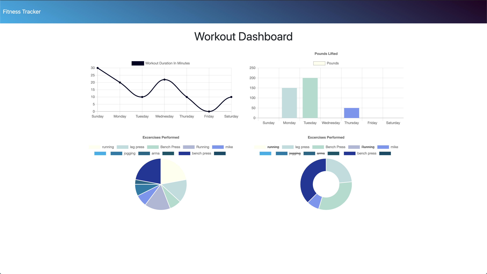

# Workout Tracker

## Deployed Link
https://boiling-garden-18020.herokuapp.com/

## Description
This is a full-stack web app for keeping track of your workouts. You can choose between Resistance and Cardio, add in details, and once the exercises have been added you will be able to view your workout stats. This app uses MongoDB and Chart.js.

## Installation

Run an npm i to install all dependencies (express, mongoose, and morgan)

## Usage 

Keeping track of your personal workouts over time. The charts show types of workouts, durations, amount of weight lifted, etc, so that you can easily view how your workouts have gone in the past.

## Github Repo Link
https://github.com/ambernina/workout-tracker

## Credits

I built all back-end code for this app, some help came from my tutor.

## License

MIT License

Copyright (c) [2020] [Amber Robertson]

Permission is hereby granted, free of charge, to any person obtaining a copy
of this software and associated documentation files (the "Software"), to deal
in the Software without restriction, including without limitation the rights
to use, copy, modify, merge, publish, distribute, sublicense, and/or sell
copies of the Software, and to permit persons to whom the Software is
furnished to do so, subject to the following conditions:

The above copyright notice and this permission notice shall be included in all
copies or substantial portions of the Software.

THE SOFTWARE IS PROVIDED "AS IS", WITHOUT WARRANTY OF ANY KIND, EXPRESS OR
IMPLIED, INCLUDING BUT NOT LIMITED TO THE WARRANTIES OF MERCHANTABILITY,
FITNESS FOR A PARTICULAR PURPOSE AND NONINFRINGEMENT. IN NO EVENT SHALL THE
AUTHORS OR COPYRIGHT HOLDERS BE LIABLE FOR ANY CLAIM, DAMAGES OR OTHER
LIABILITY, WHETHER IN AN ACTION OF CONTRACT, TORT OR OTHERWISE, ARISING FROM,
OUT OF OR IN CONNECTION WITH THE SOFTWARE OR THE USE OR OTHER DEALINGS IN THE
SOFTWARE.

